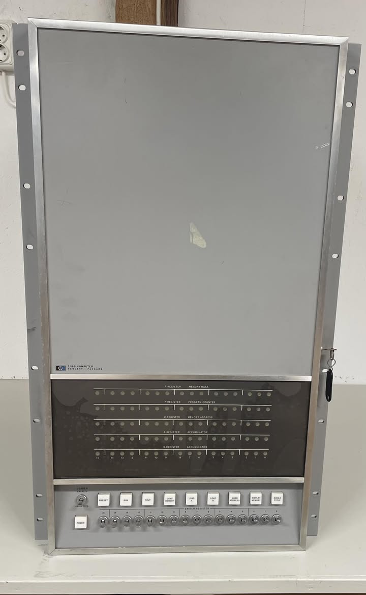
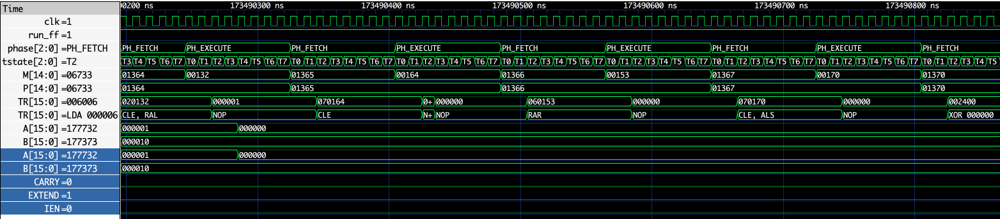

This is a a project mostly done to learn Verilog a bit. The idea is to make a implementation of the HP 2116 minicomputer from 1966. ChatGPT helped to get me started. At this point it passes the pretest of the HP diagnostic configurator paper tape successfully. Although IO is not yet implemented so much.

I use Vertilator running in a Docker container to compile and run the verilog code and the gtkwave to view the resulting wavforms.

There is a `build_all.sh` script that runs through a run of four CPU diagnoistics:
1. Pretest in Diagnostic Configurator binary
2. Memory reference instructions diagnostic
3. Alter Skip instructions group diagnostic
4. Shift rotate instructions group diagnostic

These four prove that the basic instruction set of the HP2116 is working as intended.

build_all.sh can be run with tracing if you specify the first argument as ON.

```build_all.sh ON```


The next step would be to implement DMA support and then the 13210A disk controller for the 7900 disk drives.

I use GTKwave for debugging and analysing the system. I added python tools that allow to get the mnememonic into the display. This tool is `hp21xx_gtkwave_filter.py` and when in gtkwave it is possible to select a signal and then right press on it and select "Data format". From the foldout menu I then select "Translate filter process" -> "Enable and select". Here I can the select the above mentioned python-script and enable it




